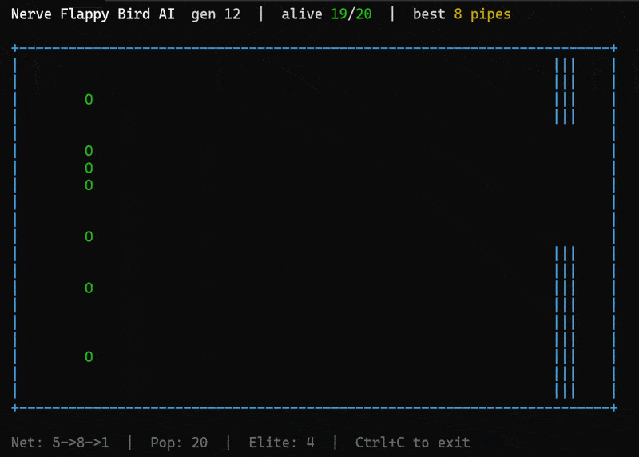

<div align="center">

# Nerve



**The modern AI stack — in pure C you can read.**

*A real Transformer, on-device learning, and sentence embeddings.
Zero dependencies. One header. Runs from a microcontroller to a browser tab.*

[](https://github.com/fkkarakurt/nerve/actions/workflows/ci.yml)
[](LICENSE)
[](nerve.h)
[](nerve.h)
[]()
[]()
[](https://www.npmjs.com/package/@fkkarakurt/nerve)
[](https://github.com/fkkarakurt/nerve/pulls)

[]()

[](https://doi.org/10.5281/zenodo.20432307)

> 📖 [**Documentation & Scientific Manual**](https://github.com/fkkarakurt/Nerve/blob/main/nerve_manual.pdf)

</div>

---

## Why Nerve?

Most neural network libraries are either massive frameworks or toy implementations.
Nerve sits in between: small enough to read in an afternoon, correct enough for real work,
portable enough to run anywhere C compiles — including bare-metal.

|  | Nerve | TensorFlow Lite | tinyML | plain C |
|--|:-----:|:---------------:|:------:|:-------:|
| Zero dependencies | ✅ | ❌ | ❌ | ✅ |
| Single file | ✅ | ❌ | ❌ | — |
| Adam optimizer | ✅ | ✅ | ❌ | — |
| Dropout | ✅ | ✅ | ❌ | — |
| ANSI C89 compatible | ✅ | ❌ | ❌ | ✅ |
| < 1 500 lines | ✅ | ❌ | ❌ | — |

---

## Beyond a library — the modern AI stack, in C you can read

Nerve started as a multilayer perceptron. It now implements, from scratch and
with zero dependencies, the pieces the giants run on — small enough to read,
portable enough to run on a 2017 laptop or a browser tab. No GPU, no Python at
runtime, no cloud, no per-token bill.

| It can… | How | Proof |
|---------|-----|-------|
| **Run a real 1.1B-parameter LLM** | decoder Transformer (RMSNorm, RoPE, GQA + KV-cache, SwiGLU, int8) in one header | TinyLlama-1.1B generates coherent text at ~3 tok/s on a laptop CPU — `studies/infer` |
| **Learn from *you*, on-device** | a frozen model's features + a tiny head trained with Nerve's own autodiff | personalises to your categories in ~40 ms, privately — `studies/infer/learn.c` |
| **Understand meaning** | a MiniLM BERT-style sentence encoder (int8, ~22 MB) | `hamburger → food`, `running shoes → fitness`; semantic search by meaning — `studies/embed` |
| **Recognise handwriting** | the 784-128-10 MLP trained on MNIST | ~97% test accuracy — `studies/mnist` |
| **Run in your browser** | the same C compiled to a **65 KB** WebAssembly module | generate · teach · search · draw a digit — all client-side, nothing leaves the page — `web/` |
| **Differentiate anything** | tape-based reverse-mode autodiff in ~200 lines | define a layer without hand-deriving its gradient — `studies/autograd` |

Every capability ships with a runnable proof, and every algorithm is grounded
in its paper — see [`docs/REFERENCES.md`](docs/REFERENCES.md). Nerve does not try
to out-scale the giants; it earns its place by being the most **readable,
portable, reproducible** implementation of the same ideas.

---

## Use it from JavaScript / TypeScript

The same engine, compiled to WebAssembly, ships on npm — for the browser or Node.
No server, no GPU, no API key; it runs on the user's machine.

[](https://www.npmjs.com/package/@fkkarakurt/nerve)

```sh
npm install @fkkarakurt/nerve
```

```js
import Nerve from "@fkkarakurt/nerve";

const nerve = await Nerve.load();

nerve.generate("Once upon a time", { onToken: t => process.stdout.write(t) });
nerve.similarity("a puppy on the grass", "a young dog in the park"); // ~0.5
nerve.teach([{ text: "i want a hamburger", label: "food" }, /* … */]);
nerve.classify("i want a cola");        // { label: "food", confidence: 0.69, … }
nerve.index(notes);
nerve.search("what keeps me awake?");   // semantic search over your own notes
```

> **Try it live in your browser** — text generation, on-device learning, semantic
> search and handwritten-digit recognition, all client-side: *(demo link coming
> with the docs site)*.

---

## Quick Start

### 3-line API

```c
#define NERVE_IMPLEMENTATION
#include "nerve.h"

nerve_t *net = nerve_new("2->4->1");   /* Adam + Tanh + Xavier — sensible defaults */
nerve_fit(net, X, y, 4, 5000);        /* train                                      */
nerve_free(net);
```

```
gcc -O2 main.c -o main -lm
```

No CMake. No vcpkg. No `apt install`. Just `gcc` and `nerve.h`.

### Full-control API

```c
#define NERVE_IMPLEMENTATION
#include "nerve.h"

network_t *net = net_allocate(3, 2, 8, 1);
net_set_optimizer(net,      NERVENET_OPTIMIZER_ADAM);
net_set_activation(net,     NERVENET_ACTIVATION_TANH);
net_initialize_xavier(net);
net_set_learning_rate(net,  0.01f);
net_set_l2_lambda(net,      1e-4f);

for (int i = 0; i < 5000; i++) {
    int j = i % 4;
    net_compute(net, in + j*2, NULL);
    net_compute_output_error(net, tgt + j);
    net_train(net);
}
net_free(net);
```

---

## Benchmark — SGD vs Adam

Results on boolean functions (7 independent runs each):

**XOR (2-4-1 network)**

| Configuration           | Converged | Avg Iters | Speedup     |
|-------------------------|:---------:|----------:|:-----------:|
| SGD / Uniform / Sigmoid | 7 / 7     |    22 285 | 1×          |
| SGD / Xavier  / Tanh    | 7 / 7     |    13 647 | 1.6×        |
| Adam / Xavier / Sigmoid | 7 / 7     |     2 601 | **8.6×**    |
| Adam / Xavier / Tanh    | 7 / 7     |     2 183 | **10.2×**   |
| Adam / He / ReLU        | 5 / 7     |     2 064 | **10.8×**   |

**4-Class Identity (4-6-4 network)**

| Configuration           | Converged | Avg Iters | Speedup     |
|-------------------------|:---------:|----------:|:-----------:|
| SGD / Uniform / Sigmoid | 7 / 7     |    22 689 | 1×          |
| Adam / He / ReLU        | 7 / 7     |     1 214 | **18.7×**   |

---

## Algorithm Reference

| Component | Options | Reference |
|-----------|---------|-----------|
| Optimizer | SGD + momentum | Rumelhart et al., 1986 |
| Optimizer | **Adam** ★ | Kingma & Ba, 2015 |
| Init | Xavier / Glorot | Glorot & Bengio, 2010 |
| Init | **He** ★ | He et al., 2015 |
| Activation | Sigmoid, Tanh, **ReLU** ★, Leaky ReLU | — |
| Regularisation | L2 weight decay | — |
| Regularisation | **Dropout** (inverted) | Srivastava et al., 2014 |

★ recommended combination for hidden layers

---

## Examples

Eleven standalone `.c` files — each compiles with a single `gcc` command.

**Core examples**

| # | File | Result |
|---|------|--------|
| 01 | `01_xor.c` | XOR in < 2 000 iterations (Adam) |
| 02 | `02_sine.c` | sin(x) approximation, MSE < 0.00002 |
| 03 | `03_iris.c` | Iris classification **96.7%** test accuracy |
| 05 | `05_regression.c` | Auto MPG regression, RMSE **3.63 mpg** |
| 06 | `06_dropout.c` | Dropout generalisation +7 pp over no-dropout |
| 07 | `07_spiral.c` | 3-class non-linear spiral **98.3%** accuracy |
| 08 | `08_model_io.c` | Save → load → fine-tune checkpoint workflow |
| 09 | `09_predictive_maintenance.c` | Live sensor monitor, 100% test accuracy |

**Terminal AI games** — neural networks that learn to play, live in your terminal

| # | File | Architecture | Algorithm |
|---|------|-------------|-----------|
| 10 | `10_snake_ai.c` | 11 → 16 → 3 | Neuroevolution, pop 100 |
| 11 | `11_pong_ai.c` | 5 → 8 → 1 | Neuroevolution vs rule-based bot |
| 12 | `12_flappy_ai.c` | 5 → 8 → 1 | 20 birds evolving simultaneously |

---

<details>
<summary><b>Example outputs</b></summary>

### XOR

```
$ gcc -O2 examples/01_xor.c -o xor -lm && ./xor

Nerve 2.0.0 — XOR Example
Architecture: 2-4-1 | Adam | Xavier Init

Results after 1847 epochs:
  [1, 1]   0.0   →   0.0031  OK
  [1, 0]   1.0   →   0.9968  OK
  [0, 1]   1.0   →   0.9967  OK
  [0, 0]   0.0   →   0.0028  OK
```

### Iris Classification

```
$ gcc -O2 examples/03_iris.c -o iris -lm && ./iris

  Final test accuracy: 96.7%

  Confusion Matrix:
                   setosa  versicolor  virginica
  setosa                8           0          0
  versicolor            0          13          0
  virginica             0           0          9
```

### 3-Class Spiral

```
$ gcc -O2 examples/07_spiral.c -o spiral -lm && ./spiral

  Final Test Accuracy: 98.3%  (59 / 60)

  +--------------------------------------------------------------+
  |XXXXXXXXXXXX..................................................|
  |XXXXXXXXXXXXXXXXXXXXXXXXXXXXXXXXXXXXXX........................|
  |XXXXXXXXXXXXXXXXXXXXXXXXXOOOOOOOOOOXXXXXXXXXXX................|
  |XXXXXXXXXXOOOOOOO........XXXX.......OOOOOOXXXXXXXXX...........|
  |OOOOOOOOOOOOOOOOOOOOOOOOOOOOOOOOOOOOOOOOOOOOOOOOOOOOOOOOOOOOOO|
  +--------------------------------------------------------------+
```

### Predictive Maintenance

```
  Reading  1   → [  OK  ] NORMAL    99.9%
  Reading  5   → [ WARN ] WARNING   98.8%
  Reading  8   → [ CRIT ] CRITICAL  97.3%
  Reading 11   → [FAULT ] FAULT     99.5%
```

</details>

---

## API Reference

<details>
<summary><b>Easy API</b></summary>

```c
/* Create */
nerve_t *net = nerve_new("2->8->1");          /* Adam + Tanh + Xavier */

nerve_config_t cfg = nerve_default_config();
cfg.lr      = 0.005f;
cfg.dropout = 0.2f;
nerve_t *net = nerve_new_ex("4->32->3", &cfg);

/* Train */
nerve_fit(net, X, y, n_samples, epochs);
nerve_fit_verbose(net, X, y, n_samples, epochs, 100);

/* Evaluate */
float acc = nerve_score(net, X, y, n_samples);
nerve_predict(net, x, output);
int   cls = nerve_classify(net, x);

/* Persist */
nerve_save(net, "model.net");
nerve_t *loaded = nerve_load("model.net");

nerve_free(net);
```

</details>

<details>
<summary><b>Core API</b></summary>

```c
/* Allocate */
network_t *net = net_allocate(3, 64, 128, 10);
net_free(net);

/* Configure */
net_set_activation(net,     NERVENET_ACTIVATION_TANH);
net_set_optimizer(net,      NERVENET_OPTIMIZER_ADAM);
net_initialize_xavier(net);
net_set_learning_rate(net,  0.01f);
net_set_momentum(net,       0.9f);
net_set_l2_lambda(net,      1e-4f);
net_set_dropout(net,        0.2f);

/* Train — one sample */
net_compute(net, input, NULL);
net_compute_output_error(net, target);
net_train(net);

/* Train — shuffled epoch */
float mse = net_train_epoch(net, inputs, targets,
                             n_samples, n_inputs, n_outputs, batch_size);

/* Inference */
float out[10];
net_compute(net, input, out);
int   label = net_classify(net, input);
float acc   = net_compute_accuracy(net, inputs, targets, n, n_in, n_out);

int cm[9] = {0};
net_confusion_matrix(net, inputs, targets, n, n_in, n_out, 3, cm);

/* Persist */
net_save(net,  "model.net");   network_t *net = net_load("model.net");
net_bsave(net, "model.bin");   network_t *net = net_bload("model.bin");
```

> After loading, re-apply `net_set_activation()` and `net_set_optimizer()`.

</details>

---

## Building

```bash
# All examples (Linux / macOS)
make -C examples

# Terminal games only
make -C examples games

# CMake (Linux / macOS / Windows)
cmake -B build && cmake --build build

# Individual example
gcc -O2 examples/01_xor.c -o xor -lm
```

## Academic foundations

Nerve is a from-scratch implementation of established results, written to be
read. Every component — attention, RoPE, RMSNorm, SwiGLU, GELU, BERT-style
encoders, Adam, dropout, autodiff, int8 quantization — is grounded in its
original paper in [`docs/REFERENCES.md`](docs/REFERENCES.md). The contribution is
readability, portability and reproducibility, not new science.

## Citation

```bib
@software{nerve,
  author       = {Fatih Küçükkarakurt},
  title        = {{Nerve: Technical Reference Manual — A Zero-Dependency Single-Header Multilayer Perceptron Library for ANSI C}},
  year         = 2026,
  publisher    = "Nerve Developer",
  doi          = {10.5281/zenodo.20432307},
  url          = {https://doi.org/10.5281/zenodo.20432307}
}
```

---

## License

Copyright (C) 2026 Fatih Küçükkarakurt

Released under the [GNU General Public License v3.0](LICENSE).
